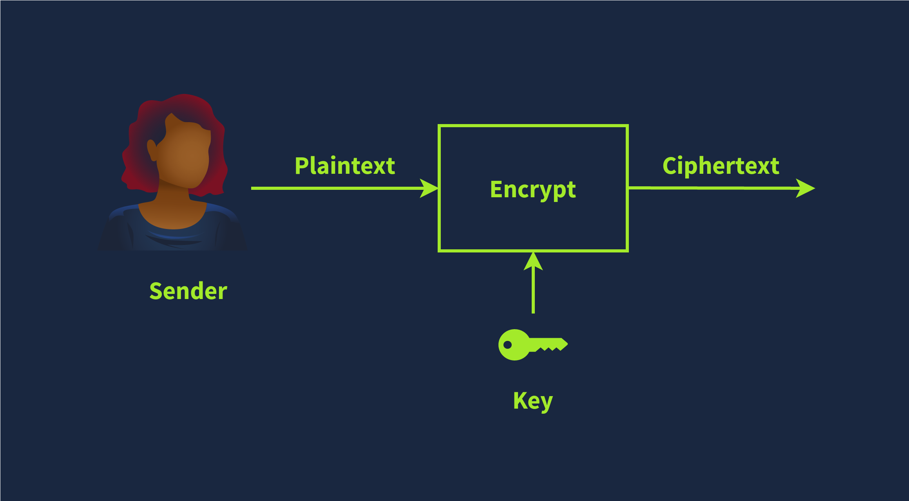

# Cryptography Basics

Learn the basics of cryptography and symmetric encryption.

## Introduction

Have you ever wondered how to prevent third parties from reading your messages? How can your app or web browser build a secure channel with a remote server? By secure, we mean that no one can read or alter the exchanged data; furthermore, we can be confident that we are connecting with the real server. Thanks to cryptography, these requirements are satisfied.

Cryptography lays the foundation for our digital world. While networking protocols have made it possible for devices spread across the globe to communicate, cryptography has made it possible to trust this communication.

## Importance of Cryptography

Cryptography’s ultimate purpose is to ensure secure communication in the presence of adversaries. The term secure includes confidentiality and integrity of the communicated data. Cryptography can be defined as the practice and study of techniques for secure communication and data protection where we expect the presence of adversaries and third parties. In other words, these adversaries should not be able to disclose or alter the contents of the messages.

Cryptography is used to protect confidentiality, integrity, and authenticity. In this age, you use cryptography daily, and you’re almost certainly reading this over an encrypted connection. Consider the following scenarios where you would use cryptography:

- When you log in to TryHackMe, your credentials are encrypted and sent to the server so that no one can retrieve them by snooping on your connection.
- When you connect over SSH, your SSH client and the server establish an encrypted tunnel so no one can eavesdrop on your session.
- When you conduct online banking, your browser checks the remote server’s certificate to confirm that you are communicating with your bank’s server and not an attacker’s.
- When you download a file, how do you check if it was downloaded correctly? Cryptography provides a solution through hash functions to confirm that your file is identical to the original one.

As you can see, you rarely have to interact directly with cryptography, but its solutions and implications are everywhere in the digital world. Consider the case where a company wants to handle credit card information and process related transactions. When handling credit cards, the company must follow and enforce the Payment Card Industry Data Security Standard (PCI DSS). In this case, the PCI DSS ensures a minimum level of security to store, process, and transmit data related to card credits. If you check the [PCI DSS for Large Organizations](https://listings.pcisecuritystandards.org/documents/PCI_DSS_for_Large_Organizations_v1.pdf), you will learn that the data should be encrypted both while being stored (at rest) and while being transmitted (in motion).

In the same way that handling payment card details requires complying with PCI DSS, handling medical records requires complying with their respective standards. Unlike credit cards, the standards for handling medical records vary from one country to another. Example laws and regulations that should be considered when handling medical records include HIPAA (Health Insurance Portability and Accountability Act) and HITECH (Health Information Technology for Economic and Clinical Health) in the USA, GDPR (General Data Protection Regulation) in the EU, DPA (Data Protection Act) in the UK. Although the list is not exhaustive, it gives an idea about the legal requirements that healthcare providers should consider depending on their country. These laws and regulations show that cryptography is a necessity that should be present yet usually hidden from direct user access.

## Plaintext to Ciphertext

Let’s start with an illustration before introducing the key terms. We begin with the plaintext that we want to encrypt. The plaintext is the readable data; it can be anything from a simple “hello”, a cat photo, credit card information, or medical health records. From a cryptography perspective, these are all “plaintext” messages waiting to be encrypted. The plaintext is passed through the encryption function along with a proper key; the encryption function returns a ciphertext. The encryption function is part of the cipher; a cipher is an algorithm to convert a plaintext into a ciphertext and vice versa.

