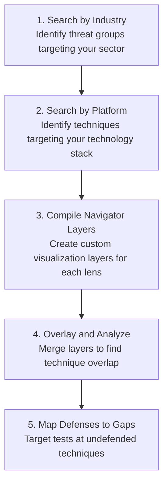

# Pentesting Methodologies and Reporting

Understanding the scope, limitations, rules of engagement, and reporting of pentesting.

## Where Threat Modeling Fits in the Pentest Lifecycle

The [Penetration Testing Execution Standard (PTES)](http://www.pentest-standard.org/index.php/Main_Page) defines seven phases that structure a professional engagement from start to finish:

- Pre-Engagement Interactions
- Intelligence Gathering
- Threat Modeling
- Vulnerability Analysis
- Exploitation
- Post-Exploitation
- Reporting

Threat modeling sits at Phase 3, after you have gathered intelligence about the target but before you begin active vulnerability analysis or exploitation. This placement is deliberate. Intelligence gathering tells you what exists on the network; threat modeling tells you what matters and what to target first. Without it, vulnerability analysis becomes a scattershot exercise, and exploitation lacks strategic direction.

Consider the Stratford engagement. After intelligence gathering, you know the company runs a public-facing web application called StratPay Portal, an internal API gateway, an Active Directory domain (`stratford.local`), a SQL Server database cluster, and a VPN-accessible admin dashboard. That is a lot of surface area. Threat modeling is where you decide which components represent the highest risk to the business and deserve the most testing time.

## The Four Questions and Three Frameworks

### The Four Questions

At its core, every threat modeling methodology answers the same four questions. These were formalized by Adam Shostack, who led threat modeling at Microsoft's Security Development Lifecycle (SDL), and they serve as the universal backbone regardless of which specific framework you use:

- What are we working on? Decompose the system into its components, data flows, and boundaries. Understand the architecture before you attack it.
- What can go wrong? Systematically identify threats against each component. This is where frameworks like STRIDE, PASTA, and MITRE ATT&CK provide structure.
- What are we going to do about it? Determine the response for each identified threat: mitigate, eliminate, transfer, or accept the risk.
- Did we do a good enough job? Validate your analysis, review completeness, and update the model as the system evolves.

For penetration testers, questions 1 and 2 directly drive your test plan. Question 3 informs the recommendations section of your report. Question 4 connects to the re-testing phase, where validated findings trigger remediation and verification.

These four questions also anchor the [Threat Modeling Manifesto](https://threatmodelingmanifesto.org/), published in 2020 by a group of 15 industry practitioners. The Manifesto established shared values for the discipline, including prioritizing finding and fixing design issues over checkbox compliance, and emphasizing that doing threat modeling matters more than debating which methodology is best.

#### Three Frameworks, Three Perspectives

This room covers three frameworks that answer question 2 ("What can go wrong?") from different angles. Each one adds a layer of depth that the others lack:

=== "STRIDE (Systematic Categories)"

    STRIDE is a **developer-centric, structure-focused threat model** developed by Microsoft. It helps identify vulnerabilities systematically by categorizing threats into six distinct types mapping directly to security properties:
    
    *   **Spoofing** (violates Authentication) - Pretending to be someone or something else.
    *   **Tampering** (violates Integrity) - Modifying data, code, or communication.
    *   **Repudiation** (violates Non-repudiation) - Denying actions performed without sufficient logging/evidence.
    *   **Information Disclosure** (violates Confidentiality) - Exposing data to unauthorized parties.
    *   **Denial of Service** (violates Availability) - Overwhelming or shutting down systems.
    *   **Elevation of Privilege** (violates Authorization) - Gaining unauthorized access levels.
    
    Applying STRIDE involves breaking down the target architecture using Data Flow Diagrams (DFDs) and evaluating every component (processes, data stores, external entities, and data flows) against this checklist. Pentesters often use STRIDE to identify flaws in application design and input validation. To prioritize these threats, STRIDE is historically paired with **DREAD**, a qualitative scoring risk assessment model that evaluates Damage, Reproducibility, Exploitability, Affected Users, and Discoverability.

=== "PASTA (Process for Attack Simulation and Threat Analysis)"

    PASTA is a **risk-centric threat modeling methodology** designed to align security testing directly with business objectives. Unlike purely technical checklists, PASTA incorporates business impact and compliance requirements throughout its process. It functions as a strategic, collaborative framework across seven distinct stages:
    
    1.  **Define Objectives**: Identify business goals, compliance standards, and risk tolerance.
    2.  **Define Technical Scope**: Document system components, physical/logical boundaries, and support systems.
    3.  **Application Decomposition**: Map out trust boundaries, data flows, and application entry points.
    4.  **Threat Analysis**: Identify scenarios based on internal and external threat intelligence.
    5.  **Vulnerability & Weakness Analysis**: Enumerate software and configuration weaknesses (e.g., using CVEs/CWEs).
    6.  **Attack Modeling & Simulation**: Perform vulnerability exploits and penetration testing to validate threats.
    7.  **Risk & Impact Analysis**: Quantify potential financial or operational loss to devise mitigation strategies.
    
    For testers, PASTA ensures that penetration testing scenarios are focused on critical business assets rather than generic vulnerability scanning.

=== "MITRE ATT&CK"

    MITRE ATT&CK (Adversarial Tactics, Techniques, and Common Knowledge) is an **attacker-centric framework** built on real-world threat intelligence. Rather than theoretical classifications, ATT&CK provides a comprehensive, globally accessible matrix of actual adversary behaviors observed in the wild.
    
    *   **Tactics**: The "why" or immediate goal of an attacker (e.g., Initial Access, Persistence, Exfiltration).
    *   **Techniques**: The "how" or the specific mechanism used to achieve a tactic (e.g., Phishing, DLL Side-Loading).
    *   **Sub-techniques**: More granular descriptions of the techniques.
    
    For a pentest, MITRE ATT&CK is invaluable for simulating realistic adversary behaviors. For instance, when testing Stratford Systems' financial environment, the team can analyze how real-world groups like FIN7 target point-of-sale systems or financial APIs, mapping the pentest plan directly to these documented techniques. This provides the client with a defense validation that is directly aligned with their threat landscape.

None of these frameworks is a silver bullet on its own. STRIDE is systematic but does not prioritize. PASTA is thorough but time-intensive. ATT&CK is evidence-based but requires threat intelligence maturity. Used together, they give you a layered, actionable threat model that translates directly into a penetration test plan.

## The building blocks: Assets, Data Flows and Trust Boundaries

Every framework in this room, whether it is STRIDE, PASTA, or MITRE ATT&CK, depends on the same foundational vocabulary. Before you can identify threats, score them, or map them to real adversary behavior, you need to understand what you are analyzing and how its pieces connect. This task introduces the building blocks that make structured threat modeling possible.

### Assets: What Are We Protecting?
Consider a bank's physical security. The building has a lobby, teller windows, a back office, a vault, and a loading dock. Each area holds different things of value, and the security controls in each area reflect that. You do not protect the lobby the same way you protect the vault. The same principle applies to digital systems.

In threat modeling, an asset is anything of value that an attacker might target or that the organization needs to protect. For penetration testers, assets fall into three categories:

=== "Data assets"
    Data assets are the information the system stores, processes, or transmits. For Stratford Systems, these include customer Personally Identifiable Information (PII), payment card numbers, authentication credentials, and transaction logs. Data assets are often the primary target; they are what attackers monetize.


=== "System assets"
    System assets are the infrastructure components that host and move data. Servers, databases, APIs, network devices, and cloud services all qualify. Compromising a system asset is often a means to reach a data asset, not an end in itself.

=== "Business process assets"
    Business process assets are the workflows and operations that generate revenue or maintain compliance. For Stratford, the payment processing workflow is a business process asset. If an attacker disrupts it, the company loses revenue regardless of whether any data is stolen.

### Data Flow Diagrams: Mapping the System

Once you know what assets exist, you need to understand how they connect. A Data Flow Diagram (DFD) is a visual representation of how data moves through a system. DFDs were originally developed in the 1970s for software engineering, but the security community adopted and extended them by adding one critical element: trust boundaries.

A DFD uses five element types, each with a standard visual notation:

| Element         | Symbol         | What it Repersents                                    | Example                                               |
|-----------------|----------------|-------------------------------------------------------|-------------------------------------------------------|
| External Entity | Rectangle      | A user, system, or service outside your control       | Customer's web browser, third-party payment processor |
| Process         | Circle         | Application logic that transforms or acts on data     | StratPay web application, API gateway                 |
| Data Store      | Parallel lines | A repository where data persists at rest              | SQL Server database, Active Directory, log files      |
| Data Flow       | Arrow          | A connection over which data moves between components | HTTPS request, API call, database query               |
| Trust Boundary  | Dashed Lines   | A border where the level of trust changes             | Internet ↔ DMZ, DMZ ↔ internal network                |

These five elements are all you need to model any system at any level of abstraction. Simple systems may have a single DFD; complex environments like Stratford's require multiple diagrams at different levels of detail.

### Building a DFD: The StratPay Portal

Let's build a DFD for the Stratford Systems architecture we will use throughout this room. We will start with the StratPay Portal, the customer-facing payment processing application, and map it step by step.

=== "Step 1 — Identify the External Entity"
    The customer interacting with StratPay through their web browser is an external entity. We draw a rectangle labeled "Customer (Browser)" on the left side of our diagram. The customer is outside Stratford's control; we cannot dictate what browser they use, whether their machine is compromised, or whether their connection is secure  
=== "Step 2 — Draw the First Trust Boundary"
    Between the customer's browser and Stratford's infrastructure lies the public Internet. When data crosses from the Internet into Stratford's DMZ (Demilitarized Zone), it transitions from an untrusted context to a semi-trusted one. We draw a dashed line labeled "Internet ↔ DMZ" between the customer and the first internal component.
=== "Step 3 — Add the First Process"
    Inside the DMZ sits the StratPay Web Application, which receives customer requests, validates input, and handles the user interface. This is a process (circle) because it transforms data: it takes raw HTTP requests and converts them into structured operations.
=== "Step 4 — Draw the Second Trust Boundary"
    The StratPay Web Application communicates with backend services on the internal network. This transition from the DMZ to the internal network is another trust boundary, drawn as a dashed line labeled "DMZ ↔ Internal Network."
=== "Step 5 — Add the Second Process"
    On the internal network side, the Internal API Gateway receives requests from the web application and routes them to the appropriate backend service. This is another process; it validates, authenticates, and forwards API calls.
=== "Step 6 — Add Data Flows"
    Arrows connect each component, showing how data moves:
    - Customer → StratPay Web App (HTTPS request containing payment details)
    - StratPay Web App → Internal API Gateway (API call with transaction data)
    - Internal API Gateway → SQL Server Database (database query)
=== "Step 7 — Add the Data Store"
    The SQL Server Database cluster stores customer PII, payment card data, and transaction history. We represent it with parallel lines on the right side of the diagram.

    The resulting DFD looks like this image drawn using Threat Dragon

    ```sql
    [Customer]  ──HTTPS──>  |  (StratPay Web App)  ──API──>  |  (API Gateway)  ──SQL──>  ║ SQL Server DB ║
              Internet↔DMZ                       DMZ↔Internal
    ```
This is a simplified Level 1 DFD. In a real engagement, you would expand each process into its own sub-diagram showing internal logic, authentication mechanisms, and error handling paths. For this room, the Level 1 view gives us enough structure to apply all three frameworks.

### Trust Boundaries: Where Vulnerabilities Concentrate

Trust boundaries deserve special attention because they are where most vulnerabilities live. Every time data crosses a trust boundary, it moves between zones with different levels of trust, and that transition creates opportunity for exploitation.

Consider the boundary between the customer's browser and the StratPay Web Application. On the customer's side, all data is untrusted; a malicious user can craft any HTTP request they want. On the StratPay side, the application must decide what to trust. If the application fails to validate input at this boundary, the result is injection attacks, cross-site scripting, parameter manipulation, and a long list of vulnerabilities you have already studied in the Web Application Security modules of this path.

The same logic applies at every boundary in the diagram. The DMZ-to-internal boundary is where an attacker who has compromised the web application attempts to pivot deeper. The internal network boundary around the database is where access control either holds or fails.

As a pentester, trust boundaries on a DFD are your initial target list. Every data flow crossing a trust boundary is a point where security controls must exist and where you should test whether they actually work. This is why building an accurate DFD is not just an academic exercise; it is the foundation of your engagement's test plan.

### Attack Surface

The attack surface of a system is the total set of points where an unauthorized user can attempt to enter data, extract data, or interact with the system. If trust boundaries tell you where controls should exist, the attack surface tells you how many entry points an attacker has to work with.

In a DFD, the attack surface includes:

- Every external entity's connection to an internal process (the customer's HTTPS connection to StratPay)
- Every data flow that crosses a trust boundary (the API calls between the DMZ and internal network)
- Every exposed service or endpoint that accepts input (login forms, API endpoints, file upload handlers)
    
A smaller attack surface is easier to defend and easier to test. Part of your threat modeling work is identifying whether the attack surface is larger than it needs to be. Does the admin dashboard need to be accessible over VPN, or could it be restricted to a hardened jump box? Does the API gateway expose endpoints that are only used internally? These are questions that arise naturally from mapping the attack surface on a DFD.

### DFD Tools

- **OWASP Threat Dragon** is a free, open-source tool specifically designed for security-focused DFDs. It supports STRIDE-based threat annotation directly on the diagram and runs as both a web application and a desktop app.
- **Microsoft Threat Modeling Tool** is a free Windows application that auto-generates STRIDE threats from DFD elements. It is useful for structured workshops but limited to Windows.
- **Draw.io or Excalidraw** works well for quick sketches during scoping calls or informal threat modeling sessions. These general-purpose diagramming tools lack security-specific features but are fast and collaborative.

## STRIDE: Systematic Threat Identification

You have a DFD. You have trust boundaries. Now you need a systematic way to ask the right questions about every component on that diagram. Without a framework, threat identification becomes a brainstorming session that depends entirely on whoever happens to be in the room. An experienced pentester might spot a dozen threats; a junior tester might spot three, and they might not overlap at all. This inconsistency is a problem when clients are paying for thorough coverage.

STRIDE solves this by giving you a structured checklist of six threat categories to evaluate against every element in your DFD. It works whether you have been pentesting for ten years or ten days.

### The Six Categories

Each STRIDE category represents a specific way that a security property can be violated. For penetration testers, each category also translates into a concrete question you should ask about every component in scope.

=== "Spoofing - Violates Authentication"
    Can an attacker impersonate a legitimate user or system?

    Spoofing occurs when an attacker pretends to be someone or something they are not, bypassing authentication controls to gain unauthorized access. This includes credential theft, session hijacking, IP spoofing, and forged authentication tokens.

    Real-world anchor: In February 2024, attackers compromised Change Healthcare(opens in new tab) by using stolen credentials to access a Citrix remote access portal that lacked Multi-Factor Authentication (MFA). The attackers impersonated a legitimate user, moved laterally for nine days, and ultimately deployed ransomware that compromised 190 million healthcare records. A threat model of the Citrix portal would have flagged the absence of MFA as a spoofing risk at the external trust boundary.
    
=== "Tampering - Violates Integrity"
    Can an attacker modify data in transit or at rest?

    Tampering covers any unauthorized modification of data, whether it is intercepting and altering network traffic, manipulating database records, injecting malicious code, or modifying configuration files.

    Real-world anchor: The SolarWinds attack(opens in new tab), disclosed in December 2020, involved a Russian APT group injecting the Sunburst backdoor into the Orion software build pipeline. The compromised updates were distributed to over 30,000 organizations, including multiple US government agencies. The attackers tampered with the software supply chain itself, and the malicious code persisted undetected for over a year. Threat modeling the build and distribution pipeline would have identified code integrity verification as a critical control at each stage.

=== "Repudiation - Violates Non-Repudiation"
    Can an attacker perform actions without being traced?

    Repudiation threats arise when a system cannot prove that a specific action was performed by a specific actor. If logging is insufficient, disabled, or easily tampered with, an attacker can act without leaving a reliable audit trail. This makes incident response slower and forensic reconstruction difficult.

    Real-world anchor: The National Public Data breach in 2024(opens in new tab) involved attackers exfiltrating 2.9 billion records through low-volume API queries designed to avoid triggering alerts. Without adequate logging and anomaly detection, the organization could not reconstruct the timeline of exfiltration for months. IBM's 2025 research found that organizations without centralized logging take significantly longer to identify and contain breaches.
=== "Information Disclosure - Violates Confidentiality"
    
=== "Denial of Service - Violates Availability"

    Can an attacker disrupt service for legitimate users?

    Denial of Service (DoS) threats target the availability of a system, making it unresponsive or entirely unavailable. This includes network-level volumetric attacks, application-layer resource exhaustion, logic bombs, and targeted crashes triggered by malformed input.

    Real-world anchor: The Mirai botnet(opens in new tab), originally responsible for a 620 Gbps attack in 2016, continues to evolve. In 2024, Cloudflare(opens in new tab) blocked a record-setting Distributed Denial of Service (DDoS) attack peaking at 5.6 Terabits per second, launched from over 13,000 compromised IoT devices. Cloudflare reported blocking 21.3 million DDoS attacks in 2024, a 53% increase over the prior year.

=== "Elevation of Privilege - Violates Authorization"
    Can an attacker gain permissions beyond their intended role?

    Elevation of Privilege (EoP) occurs when an attacker escalates from a lower privilege level to a higher one, gaining access to functionality or data they were never meant to reach. This includes exploiting broken access controls, kernel vulnerabilities, misconfigured permissions, and application logic flaws.

    Real-world anchor: Log4Shell (CVE-2021-44228)(opens in new tab), disclosed in December 2021, allowed remote code execution through a JNDI lookup injection in the widely used Apache Log4j library. An attacker who could control a single log message could execute arbitrary code with the full privileges of the application. Over 830,000 attack attempts were detected within 72 hours of public disclosure. A DFD showing user input flowing through the application to Log4j and then to an external JNDI/LDAP server would have exposed the trust boundary violation where user-controlled data triggered an unrestricted external lookup. 

## The DFD-to-STRIDE Mapping Table

Not every STRIDE category applies to every DFD element. The following mapping table, derived from the original Microsoft SDL guidance, defines which categories are relevant for each element type:


| DFD Element     | Spoofing | Tampering | Repudiation | Information Disclosure | Denial of Service | Elevation of Privilege |
|-----------------|----------|-----------|-------------|------------------------|-------------------|------------------------|
| External Entity | [X]      | [ ]       | [x]         | [ ]                    | [ ]               | [ ]                    |
| Process         | [x]      | [x]       | [x]         | [x]                    | [x]               | [x]                    |
| Data Flow       | [ ]      | [x]       | [ ]         | [x]                    | [x]               | [ ]                    |
| Data Store      | [ ]      | [x]       | [x]         | [x]                    | [x]               | [ ]                    |

Two observations stand out. First, processes are susceptible to all six STRIDE categories, making them the highest-priority elements in any analysis. Every process on your DFD should receive full STRIDE treatment. Second, the asterisk on Data Store / Repudiation reflects a specific case: data stores are generally not subject to repudiation threats unless the data store serves as an audit log. If an attacker can tamper with log files, they can erase evidence of their actions, which is a repudiation threat enabled by tampering.

## Two Analysis Approaches

STRIDE can be applied in two ways, and the choice matters when you are working under time constraints.

=== "STRIDE-per-Element"
    STRIDE-per-Element visits every component on the DFD and checks each applicable STRIDE category. This is comprehensive but time-intensive. For a DFD with 15 elements, you are evaluating up to 90 threat combinations (15 elements × 6 categories, minus the non-applicable cells from the mapping table). This approach works well for smaller systems or high-assurance environments where thoroughness is more important than speed.

=== "STRIDE-per-Element"
    STRIDE-per-Interaction focuses specifically on data flows that cross trust boundaries. Instead of analyzing every element, you analyze every interaction between elements in different trust zones. For penetration testers, this is often the more efficient choice because trust-boundary-crossing data flows are exactly where vulnerabilities concentrate, as we discussed in Task 2.

## Applied Walkthrough: STRIDE Against the StratPay Web Application

Let's apply STRIDE to the StratPay Web Application process from the Task 2 DFD. As a process, it is susceptible to all six categories:

=== "Spoofing -"
    Can an attacker impersonate a legitimate customer? The web application authenticates users through a login form. If session tokens are predictable, cookies lack secure flags, or the application is vulnerable to credential stuffing, an attacker could assume another customer's identity.

=== "Tampering -"
    Can payment data be modified in transit? If TLS is misconfigured or the application accepts unsigned parameters, an attacker could intercept and alter transaction amounts, recipient account numbers, or other payment details through parameter manipulation or man-in-the-middle positioning.

=== "Repudiation - "
    Can a transaction be performed without an audit trail? If the application does not log transaction events with sufficient detail (timestamps, source IPs, user identifiers, action performed), a disputed transaction cannot be reliably attributed. For a payment system subject to PCI DSS, this is a compliance failure as well as a security gap.
    
=== "Information Disclosure"
    Can an attacker extract other customers' payment data? Insecure Direct Object Reference (IDOR) vulnerabilities, SQL injection, or overly verbose API responses could allow an attacker to access records belonging to other customers. Error messages that reveal database structure or internal paths also fall under this category.

=== "Denial of Service"
    Can the payment portal be overwhelmed? Application-layer attacks targeting expensive operations (complex search queries, large file uploads, or computationally intensive payment validation routines) could exhaust server resources without requiring massive bandwidth.
  
=== "Elevation of Privilege"
    Can a regular customer access admin functions? Broken access control, missing authorization checks on admin API endpoints, or client-side-only role enforcement could allow a standard user to access the admin dashboard or perform privileged operations like issuing refunds.

Each of these identified threats becomes a potential test case in your penetration test plan. STRIDE does not tell you which of these to test first; that is what DREAD, the subject of the next task, provides.

## Scoring Threats With DREAD

DREAD is a simple risk-rating model that helps you prioritize which threats to address first. While STRIDE enumerates the what (What kind of threats exist?), DREAD answers the which (Which threats matter most?). It originated inside Microsoft as part of the Security Development Lifecycle (SDL) and remains widely used for its simplicity and ease of application, especially during the initial threat-modeling phase.

After running STRIDE against the StratPay Portal in the previous task, your team identified 23 potential threats across six categories. The project manager looks at the list and asks the question that every pentester hears on a time-boxed engagement: *"Which ones do we test first?"*

STRIDE is excellent at identifying what can go wrong, but it does not tell you how bad each threat is. A spoofing threat against the customer login and a denial of service threat against an internal monitoring dashboard are both valid STRIDE findings, but they are not equally urgent. You need a way to score and rank threats so your limited testing time goes where it matters most.

**DREAD** is a lightweight risk scoring model designed to do exactly that. It gives you a fast, repeatable method for prioritizing threats during a threat modeling session.

!!! info "Origins and Deprecation"
    DREAD was published in 2002 in *Writing Secure Code* (2nd edition) by Michael Howard and David LeBlanc at Microsoft. It was originally used alongside STRIDE as part of Microsoft's internal security review process.
    
    Here is the part where we are transparent about history: **Microsoft internally discontinued DREAD around 2008**. Adam Shostack, who owned SDL threat modeling at Microsoft, explained the reasoning: different teams assigned wildly different scores to the same threat, making cross-team comparisons unreliable. One team's "7" was another team's "4," and the arguments about scoring consumed time that should have been spent analyzing threats. Microsoft replaced DREAD with a simpler approach: predefined severity classifications of *Critical*, *Important*, *Moderate*, and *Low*, based on specific vulnerability characteristics rather than subjective numerical ratings.
    
    Despite this deprecation, DREAD remains widely used. Fortune 500 companies, military organizations, and penetration testing firms continue to use it for quick triage. More importantly for your career, **DREAD is explicitly tested on the CISSP** (Domain 1, Objective 1.11) and appears in other certificates' training materials. You will encounter it on certification exams and in professional practice.
    
    The lesson here is not that DREAD is bad. The lesson is that every scoring model has limitations, and understanding those limitations is part of using the model effectively.

### The Five Categories
Each DREAD category is scored on a scale of **1 to 10**, where 1 represents minimal risk and 10 represents maximum risk.

=== "Damage Potential"
    **Core Question**: *How severe is the impact if this threat is successfully exploited?*
    
    This category measures the worst-case outcome. A threat that leads to complete database compromise and exfiltration of all customer records scores near 10. A threat that leaks a non-sensitive application version number scores near 1. Consider both data impact (confidentiality, integrity) and operational impact (availability, business disruption).
    
    | Score  | Impact Severity | Description                                                                       |
    |:------:|:----------------|:----------------------------------------------------------------------------------|
    | **10** | **Critical**    | Complete system compromise, full data exfiltration, or total business disruption. |
    | **5**  | **Medium**      | Partial data exposure, limited system access, or degraded functionality.          |
    | **1**  | **Low**         | Trivial information leakage with no meaningful impact.                            |

=== "Reproducibility"
    **Core Question**: *How reliably can the attack be repeated?*
    
    A threat that can be triggered every time with the same steps scores high. A threat that depends on a specific race condition, a narrow time window, or unpredictable environmental factors scores low. Reproducibility matters for pentesters because a highly reproducible vulnerability is easier to demonstrate and harder for the client to dismiss.
    
    | Score  | Reproducibility | Description                                                                   |
    |:------:|:----------------|:------------------------------------------------------------------------------|
    | **10** | **High**        | Attack succeeds every time, can be scripted or automated.                     |
    | **5**  | **Medium**      | Attack works intermittently or requires specific conditions.                  |
    | **1**  | **Low**         | Attack depends on rare circumstances and is difficult to reproduce on demand. |

=== "Exploitability"
    **Core Question**: *What skill level, access, and tools are required to exploit this threat?*
    
    A vulnerability that can be exploited with freely available automated tools and no authentication scores high. A vulnerability that requires deep reverse engineering expertise, custom exploit development, and physical access to the server room scores low.
    
    | Score  | Exploitability     | Description                                                                   |
    |:------:|:-------------------|:------------------------------------------------------------------------------|
    | **10** | **Low Barrier**    | Automated tools exist, no authentication required, scriptable by a beginner.  |
    | **5**  | **Medium Barrier** | Requires authenticated access or moderate technical skill.                    |
    | **1**  | **High Barrier**   | Requires advanced exploit development, zero-day research, or physical access. |

=== "Affected Users"
    **Core Question**: *What proportion of users or systems are impacted if this threat is exploited?*
    
    A threat that impacts every customer who has ever used the payment portal scores high. A threat that only affects a single administrator account on a rarely used internal tool scores low. Consider both breadth (how many users) and significance (are the affected users high-value targets like administrators?).
    
    | Score  | User Scope     | Description                                                         |
    |:------:|:---------------|:--------------------------------------------------------------------|
    | **10** | **Widespread** | All users, including administrators, are affected.                  |
    | **5**  | **Moderate**   | A significant subset of users or a critical user group is affected. |
    | **1**  | **Niche**      | A single user in an uncommon configuration is affected.             |

=== "Discoverability"
    **Core Question**: *How easy is this vulnerability to find?*
    
    A vulnerability that appears in automated scanner output, is visible in the URL, or is documented in a public CVE scores high. A vulnerability that requires deep manual analysis, source code review, or insider knowledge scores low.
    
    | Score  | Discoverability | Description                                                                    |
    |:------:|:----------------|:-------------------------------------------------------------------------------|
    | **10** | **Easy**        | Visible to automated scanners, documented publicly, or trivially discoverable. |
    | **5**  | **Medium**      | Requires targeted manual testing or familiarity with the application.          |
    | **1**  | **Hard**        | Requires extensive reverse engineering or access to source code.               |

!!! warning "The Discoverability Controversy"
    Discoverability is the most debated category in the model, and this debate is worth understanding because it sharpens your thinking about risk assessment in general.
    
    Many security practitioners automatically assign a maximum score of **10** to Discoverability, regardless of the actual difficulty of finding the vulnerability. Their reasoning: assuming a vulnerability is hard to discover is a form of *security through obscurity*, which is not a reliable defense. A vulnerability might be obscure today and publicized tomorrow when a researcher posts a write-up, a scanner adds a detection rule, or an attacker shares the technique on a forum.
    
    This perspective is compelling enough that OpenStack adopted **"DREAD-D"**, a modified version that drops Discoverability entirely and calculates risk from the remaining four categories. Some OWASP guidance has echoed this recommendation.
    
    The counterargument is that Discoverability captures something real. A vulnerability buried deep in a complex multi-step workflow genuinely is less likely to be found and exploited than one visible in the login URL. Removing the category loses information.
    
    There is no universally correct answer. What matters is that you make a deliberate, documented decision about how your team handles Discoverability and apply that decision consistently across all scored threats. Inconsistency, not the category itself, was the core problem Microsoft identified.

### Calculating the Risk Score
The DREAD risk score is calculated as the mathematical average of all five category scores:

$$\text{Risk Score} = \frac{\text{Damage} + \text{Reproducibility} + \text{Exploitability} + \text{Affected Users} + \text{Discoverability}}{5}$$

The resulting score maps to a four-tier severity scale:

|  Score Range   | Severity Rating | Visual Indicator                                                    |
|:--------------:|:----------------|:--------------------------------------------------------------------|
| **9.0 – 10.0** | **Critical**    | <span style="color: #ff3333; font-weight: bold;">🔴 Critical</span> |
| **7.0 – 8.9**  | **High**        | <span style="color: #ff9900; font-weight: bold;">🟠 High</span>     |
| **4.0 – 6.9**  | **Medium**      | <span style="color: #ffff00; font-weight: bold;">🟡 Medium</span>   |
| **1.0 – 3.9**  | **Low**         | <span style="color: #00e676; font-weight: bold;">🟢 Low</span>      |

---

### Worked Examples

=== "Worked Example 1: SQL Injection in Payment Search"
    Let's score a SQL injection vulnerability discovered during STRIDE analysis of the StratPay Web Application. The vulnerability exists in the payment search feature, which allows customers to look up past transactions by date and amount.
    
    | Category            | Score | Reasoning                                                                                                                                                                            |
    |:--------------------|:-----:|:-------------------------------------------------------------------------------------------------------------------------------------------------------------------------------------|
    | **Damage**          | **9** | Successful exploitation grants access to the SQL Server database containing customer PII and payment card data. Full data exfiltration is possible.                                  |
    | **Reproducibility** | **8** | The injection point is consistent and can be scripted with `sqlmap`. Minor variations in input formatting do not affect reliability.                                                 |
    | **Exploitability**  | **7** | SQL injection is a well-documented technique with mature automated tools. The attacker needs no authentication to reach the search feature, though some WAF evasion may be required. |
    | **Affected Users**  | **9** | All customers with stored payment data are impacted. The database does not segment records by customer tier or region.                                                               |
    | **Discoverability** | **8** | The search feature is publicly accessible. Automated scanners detect the injection point, and verbose error messages reveal the database type and query structure.                   |
    
    **Risk Score Calculation**: 
    
    $$\text{Risk Score} = \frac{9 + 8 + 7 + 9 + 8}{5} = \mathbf{8.2} \ \ (\text{High})$$
    
    *This threat goes to the top of the test plan. The combination of high damage, broad user impact, and low exploitation barrier makes it a priority.*

=== "Worked Example 2: Verbose Error Messages on Admin Dashboard"
    Now consider a lower-severity finding: the admin dashboard, accessible only through the VPN, displays detailed stack traces and database connection strings when errors occur.
    
    | Category            | Score  | Reasoning                                                                                                                                                                                                        |
    |:--------------------|:------:|:-----------------------------------------------------------------------------------------------------------------------------------------------------------------------------------------------------------------|
    | **Damage**          | **3**  | The exposed information (stack traces, connection strings) is useful for further attacks but does not directly compromise data. It is an information disclosure that enables, rather than constitutes, a breach. |
    | **Reproducibility** | **10** | Triggering an error message is trivial and succeeds every time. Submitting malformed input to any form field produces the verbose output.                                                                        |
    | **Exploitability**  | **9**  | No special tools or skills required. Any authenticated admin user can trigger the error by entering unexpected input.                                                                                            |
    | **Affected Users**  | **2**  | Only administrators with VPN access can reach the dashboard. The exposed information affects the organization's security posture rather than individual users.                                                   |
    | **Discoverability** | **6**  | The vulnerability requires VPN access and an admin account to reach. It would not appear in an external scan. However, once on the dashboard, the errors are immediately visible.                                |
    
    **Risk Score Calculation**: 
    
    $$\text{Risk Score} = \frac{3 + 10 + 9 + 2 + 6}{5} = \mathbf{6.0} \ \ (\text{Medium})$$
    
    *This threat is worth documenting but does not warrant priority testing time. The low Damage and Affected Users scores pull the overall rating down despite high Reproducibility and Exploitability.*

---

### Comparing the Two Scores
The two examples illustrate why scoring matters. Without DREAD, both threats sit on the same undifferentiated STRIDE list. With DREAD, you can clearly articulate why the SQL injection (**8.2, High**) demands immediate attention while the verbose error messages (**6.0, Medium**) can be addressed after higher-priority threats are tested. This is the conversation you will have with project managers and clients throughout your career: not just what is wrong, but how bad it is relative to everything else.

### DREAD vs. CVSS: A Brief Comparison
You will encounter the Common Vulnerability Scoring System (CVSS) far more often than DREAD in professional practice. CVSS, currently at version 4.0, is the industry standard used by the National Vulnerability Database (NVD), bug bounty platforms, and most commercial security tools.

| Metric               | DREAD                                    | CVSS (v4.0)                                        |
|:---------------------|:-----------------------------------------|:---------------------------------------------------|
| **Complexity**       | Lightweight (5 categories)               | High (12+ base, threat, and environmental metrics) |
| **Speed**            | Extremely fast (minutes per threat)      | Slow (requires detailed technical analysis)        |
| **Consistency**      | Subjective (varies by assessor/team)     | High consistency (strict matrix criteria)          |
| **Primary Use Case** | Real-time threat modeling / early triage | Formal vulnerability disclosure / reporting        |
| **Assessor Skill**   | Beginner to Intermediate                 | Advanced / Expert knowledge of protocol metrics    |

DREAD's value is speed and accessibility. During a threat modeling workshop where you need to triage 20 threats in an hour, DREAD's five intuitive categories and simple average calculation get you to a prioritized list fast. CVSS is the right tool for formal vulnerability reporting; DREAD is the right tool for real-time threat modeling triage. They serve different purposes, and professional pentesters use both.
DREAD's value is speed and accessibility. During a threat modeling workshop where you need to triage 20 threats in an hour, DREAD's five intuitive categories and simple average calculation get you to a prioritized list fast. CVSS is the right tool for formal vulnerability reporting; DREAD is the right tool for real-time threat modeling triage. They serve different purposes, and professional pentesters use both.

## PASTA: Risk-Centric Threat Modeling

STRIDE told us what could go wrong with each component in our DFD. DREAD told us how bad each threat is. But neither framework asked a critical question: **what does the business actually care about?**

Consider two identical SQL injection vulnerabilities:
- One exists in a staging environment used by three developers for testing.
- The other exists in the StratPay Portal processing live payment transactions for 200,000 customers.

Technically, they are the same vulnerability. From a business perspective, they differ by orders of magnitude. A framework that treats them equally is missing crucial context.

**PASTA** forces you to start from business objectives and work toward technical threats, not the other way around. It is the framework that teaches penetration testers to think like both an attacker and a business advisor.

!!! info "Origins of PASTA"
    PASTA stands for **Process for Attack Simulation and Threat Analysis**. It was developed by Tony UcedaVélez, CEO of the security firm VerSprite, and first presented at OWASP AppSecEU in 2012. The comprehensive reference is *Risk Centric Threat Modeling* (Wiley, 2015), co-authored by UcedaVélez and Marco M. Morana.
    
    Where STRIDE is a threat classification tool and DREAD is a scoring tool, PASTA is a complete methodology. It defines a seven-stage process that progresses from business context through technical analysis to risk-quantified output. VerSprite uses PASTA as the foundation for every penetration testing engagement they conduct; the threat model directly informs what gets tested and how findings are communicated.

### The Seven Stages
Each PASTA stage builds on the one before it, creating a progressive narrowing from broad business context to specific, prioritized attack paths.

=== "Stage 1 — Define Objectives"
    **Core Question**: *What does the business need to protect, and why?*
    
    This stage aligns the threat model with the organization's business goals, compliance requirements, and risk appetite. For Stratford Systems, the key business objectives are:
    - **PCI DSS compliance**: Stratford processes payment card data. A breach involving cardholder data triggers mandatory reporting, potential fines, and possible loss of the ability to process payments.
    - **Customer trust**: Stratford's revenue depends on customer trust. A publicized breach erodes trust and drives customer attrition.
    - **Transaction uptime**: Every minute the payment portal is unavailable represents lost revenue. Availability is a direct business concern.
    
    !!! tip "Pentest Connection"
        Stage 1 answers the question *"Why are we doing this pentest?"* If the engagement is driven by PCI DSS compliance requirements, your testing priorities and reporting structure will differ from an engagement driven by a recent security incident.

=== "Stage 2 — Define Technical Scope"
    **Core Question**: *What systems, components, and technologies are in play?*
    
    This stage maps the architecture, identifies the attack surface, and inventories the components that support the business objectives defined in Stage 1. For Stratford:
    - **StratPay Portal**: Public-facing web application (HTTPS), hosted in the DMZ.
    - **Internal API Gateway**: Middleware connecting the portal to backend services.
    - **SQL Server Database Cluster**: Stores customer PII and payment card data.
    - **Active Directory (`stratford.local`)**: Employee authentication and SSO integration.
    - **Admin Dashboard**: Internal management interface, accessible via VPN only.
    
    !!! tip "Pentest Connection"
        Stage 2 directly informs your scope document and Rules of Engagement (RoE). The component inventory becomes the boundary of what you are authorized to test.

=== "Stage 3 — Application Decomposition"
    **Core Question**: *How does data move through the system, and where are the trust boundaries?*
    
    This stage creates the Data Flow Diagrams we built in Task 2. You identify processes, data stores, external entities, data flows, and trust boundaries. If you have already completed your DFDs during a STRIDE analysis, you can reuse them here; PASTA and STRIDE share this foundational mapping artifact.
    
    !!! tip "Pentest Connection"
        The entry points identified during application decomposition become your initial target list. Every data flow crossing a trust boundary is a point where you will probe for vulnerabilities.

=== "Stage 4 — Threat Analysis"
    **Core Question**: *What threats are realistic for this specific organization and industry?*
    
    This is where PASTA diverges significantly from STRIDE. Instead of walking a generic checklist of threat categories, Stage 4 incorporates threat intelligence specific to the client's industry, geography, and technology stack.
    
    For Stratford Systems (financial services), relevant intelligence sources include:
    - **Verizon DBIR**: The 2025 report found that 88% of system intrusion breaches in the financial sector involved stolen credentials, and 36% of all breaches originated from third-party compromises.
    - **Industry incident history**: Recent high-profile breaches demonstrate that financial organizations are prime targets for ransomware groups using credential theft as an initial vector.
    
    !!! tip "Pentest Connection"
        Intelligence-driven testing focuses your engagement on realistic threats. If threat intelligence shows that 88% of breaches in your client's sector involve stolen credentials, credential-based attack testing should consume a significant portion of your engagement window.

=== "Stage 5 — Vulnerability Analysis"
    **Core Question**: *What known vulnerabilities exist in the target systems, and how do they relate to the identified threats?*
    
    This stage maps known vulnerabilities to the threats identified in Stage 4. Sources include CVE databases, prior vulnerability scan results, configuration reviews, and publicly disclosed issues affecting the client's technology stack.
    
    !!! tip "Pentest Connection"
        Stage 5 prioritizes which vulnerabilities to confirm through active testing. Instead of running every check in your scanner's database, you focus on vulnerabilities that map directly to the threats identified in Stage 4.

=== "Stage 6 — Attack Modeling"
    **Core Question**: *How do threats and vulnerabilities chain together into realistic attack paths?*
    
    Stage 6 is where PASTA earns its name. You build attack trees that model complete attack scenarios from initial access to the final objective. Consider the Stratford CISO's concern: *"I want to know if an attacker who compromises an employee credential can reach our payment database."*
    
    ```text
    Goal: Exfiltrate customer payment data
    ├── Path A: External exploitation
    │   ├── Exploit SQL injection in StratPay Portal
    │   └── Extract database contents directly
    ├── Path B: Credential-based access
    │   ├── Phish Stratford employee
    │   ├── Harvest credentials
    │   ├── Authenticate to VPN with stolen credentials
    │   ├── Access admin dashboard
    │   ├── Pivot to internal network
    │   └── Query SQL Server database
    └── Path C: Supply chain compromise
        ├── Compromise third-party payment processor integration
        └── Intercept or redirect transaction data
    ```
    
    !!! tip "Pentest Connection"
        Attack trees become your test plan. Each path defines a sequence of attack steps you will attempt during the engagement. If Path B fails at the VPN authentication step (because MFA is properly enforced), you document that control as validated and move to the next path.

=== "Stage 7 — Risk and Impact Analysis"
    **Core Question**: *What is the business impact if each attack path succeeds?*
    
    The final stage quantifies the business consequences of each validated attack path. This is where the thread from Stage 1 (business objectives) connects to Stage 6 (attack paths) to produce a risk statement the client can act on.
    
    For Stratford, if Path B succeeds (phishing → VPN → admin dashboard → database):
    - **PCI DSS impact**: Mandatory breach notification, potential fines of $5,000–$100,000 per month of non-compliance, forensic investigation costs, and possible suspension of card processing privileges.
    - **Customer impact**: 200,000 customers require notification; credit monitoring costs estimated at $30–$35 per affected individual.
    
    !!! tip "Pentest Connection"
        Stage 7 is how you write the Executive Summary of your penetration test report. Grounding technical risks in business impact language is what gets remediation budgets approved.

### STRIDE vs. PASTA: Choosing the Right Tool
The two frameworks are complementary, not competing. The following comparison highlights when each one is the better fit:

| Dimension            | STRIDE                                     | PASTA                                           |
|:---------------------|:-------------------------------------------|:------------------------------------------------|
| **Primary Question** | *"What can go wrong with this component?"* | *"What would an attacker do to this business?"* |
| **Starting Point**   | System architecture (DFD)                  | Business objectives                             |
| **Perspective**      | Defender (design review)                   | Attacker (simulation)                           |
| **Output**           | Categorized threat list                    | Prioritized risk inventory with business impact |
| **Best Used When**   | Quick threat identification during design  | Pentest scoping, risk-driven assessments        |
| **Time Investment**  | Moderate (hours)                           | High (days to weeks for full execution)         |

In practice, the two frameworks nest together. You can use STRIDE within PASTA's Stage 4 for systematic threat identification, then let PASTA's remaining stages add business context, vulnerability correlation, attack path modeling, and risk quantification.

---

## MITRE ATT&CK for Threat Modeling

STRIDE gives you categories of threats. PASTA gives you business context. But when a client asks, *"What specific attack techniques should we be worried about?"*, you need answers grounded in observed adversary behavior, not theoretical models.

This is where **MITRE ATT&CK** transforms threat modeling from an abstract exercise into an intelligence-driven process.

### What Is MITRE ATT&CK?
ATT&CK stands for **Adversarial Tactics, Techniques, and Common Knowledge**. It is a globally accessible, curated knowledge base of adversary behaviors based on real-world observations, maintained by the MITRE Corporation. ATT&CK catalogs what attackers actually do after gaining access to systems, organized into a structured matrix that security professionals use for threat modeling, detection engineering, red teaming, and gap analysis.

The Enterprise matrix contains a clear hierarchy:

- **Tactic**: The adversary's goal at a particular phase of an operation. (e.g., *Initial Access*, *Lateral Movement*). Tactics answer **why** the attacker is performing an action.
- **Technique**: The method the adversary uses to achieve that goal. (e.g., *Phishing* [T1566], *Exploit Public-Facing Application* [T1190]). Techniques answer **how** the attacker accomplishes the tactic.
- **Sub-technique**: A more specific variant of a technique. (e.g., Phishing [T1566] breaks down into *Spearphishing Attachment* [T1566.001], *Spearphishing Link* [T1566.002]).

### The 14 Enterprise Tactics
The Enterprise matrix organizes adversary behavior into 14 tactics, ordered roughly by the progression of an intrusion:

|   #    | Tactic                   | Adversary's Goal                             | Pentest Relevance                                           |
|:------:|:-------------------------|:---------------------------------------------|:------------------------------------------------------------|
| **1**  | **Reconnaissance**       | Gather information to plan the attack        | OSINT, target profiling, attack surface mapping             |
| **2**  | **Resource Development** | Establish infrastructure and capabilities    | Domain registration, tool acquisition, account creation     |
| **3**  | **Initial Access**       | Get into the target network                  | Phishing, exploiting public-facing apps, valid accounts     |
| **4**  | **Execution**            | Run malicious code on the target             | Command-line tools, scripting interpreters, scheduled tasks |
| **5**  | **Persistence**          | Maintain access across reboots/resets        | Registry run keys, scheduled tasks, account manipulation    |
| **6**  | **Privilege Escalation** | Gain higher-level permissions                | Exploitation, token manipulation, misconfigurations         |
| **7**  | **Defense Evasion**      | Avoid detection by security controls         | Obfuscation, disabling defenses, indicator removal          |
| **8**  | **Credential Access**    | Steal credentials for further access         | Dumping password hashes, keylogging, Kerberoasting          |
| **9**  | **Discovery**            | Learn about the target environment           | Network scanning, account enumeration, permission checks    |
| **10** | **Lateral Movement**     | Move through the network to reach objectives | Pass-the-Hash, remote services, internal spearphishing      |
| **11** | **Collection**           | Gather data of interest before exfiltration  | Screen capture, email collection, data staging              |
| **12** | **Command and Control**  | Communicate with compromised systems         | Encrypted channels, web protocols, domain fronting          |
| **13** | **Exfiltration**         | Steal data from the target network           | Exfiltration over C2, alternative protocols                 |
| **14** | **Impact**               | Disrupt, destroy, or manipulate systems      | Data encryption (ransomware), defacement                    |

### Connecting ATT&CK to the Cyber Kill Chain
While the Cyber Kill Chain provides the strategic roadmap, ATT&CK provides turn-by-turn navigation:

| Cyber Kill Chain Phase    | ATT&CK Tactics                                                                                                |
|:--------------------------|:--------------------------------------------------------------------------------------------------------------|
| **Reconnaissance**        | Reconnaissance                                                                                                |
| **Weaponization**         | Resource Development                                                                                          |
| **Delivery**              | Initial Access                                                                                                |
| **Exploit / Install**     | Execution, Persistence, Privilege Escalation, Defense Evasion, Credential Access, Discovery, Lateral Movement |
| **Command and Control**   | Command and Control                                                                                           |
| **Actions on Objectives** | Collection, Exfiltration, Impact                                                                              |

ATT&CK expands the Kill Chain's mid-game significantly. Tactics like *Privilege Escalation*, *Defense Evasion*, *Credential Access*, *Discovery*, and *Lateral Movement* describe adversary behaviors inside a compromised network after initial access—exactly where penetration testers spend most of their time.

### Threat Modeling with ATT&CK: The CTID Methodology
MITRE's Center for Threat-Informed Defense (CTID) published **"Threat Modeling with ATT&CK"**, which structures threat modeling around a key innovation: **theory-evidence scoring**.

When you identify a threat using STRIDE, it is theoretical: *"Spoofing could occur at this trust boundary."* When you identify a threat using ATT&CK, you can ground it in observed evidence: *"FIN7, a threat group known to target financial services, has been observed using Phishing (T1566) and Valid Accounts (T1078) against organizations in this sector."*

The workflow follows five key steps:



### Applied Walkthrough: ATT&CK Against Stratford Systems
Let's apply this workflow to the Stratford engagement:

1. **Industry Search (Financial Services)**: FIN7 is a prominent group targeting financial institutions. Searching ATT&CK for FIN7's known techniques reveals:
    - **T1566 (Phishing)**: Gaining initial foothold via spearphishing emails.
    - **T1059 (Execution)**: Using PowerShell and JavaScript post-access.
    - **T1078 (Valid Accounts)**: Reusing credentials to bypass defenses.
2. **Platform Search (Windows & SQL Server)**:
    - **T1190 (Exploit Public-Facing Application)**: Target StratPay Portal.
    - **T1133 (External Remote Services)**: Target the VPN-accessible admin dashboard.
    - **T1505.001 (SQL Stored Procedures)**: Target database persistence.
3. **Combined Analysis**: The overlay highlights that **T1078 (Valid Accounts)** appears in both the industry and platform layers. Stolen credentials are FIN7's primary weapon, and Stratford's AD-integrated SSO and database login services provide multiple targets. This shifts our test case from a generic *"test for spoofing"* to a specific threat-informed test: *"Test whether stolen Active Directory credentials grant VPN access, and if so, whether the admin dashboard enforces additional verification beyond SSO."*

### Key Tools

=== "ATT&CK Navigator"
    A free, web-based tool that allows you to create custom layers with color coding, scores, and comments, then combine layers mathematically using matrix multiplication or overlays to identify technique overlap.

=== "CISA Decider"
    A free tool from the Cybersecurity and Infrastructure Security Agency that helps translate conceptual attack steps into ATT&CK Tactics, Techniques, and Procedures (TTPs) through guided decision-tree questions.

=== "Atomic Red Team"
    An open-source library maintained by Red Canary that provides small, portable test cases mapped directly to individual ATT&CK techniques. You can run these "atomic tests" to validate whether specific techniques succeed or get detected in your environment.
